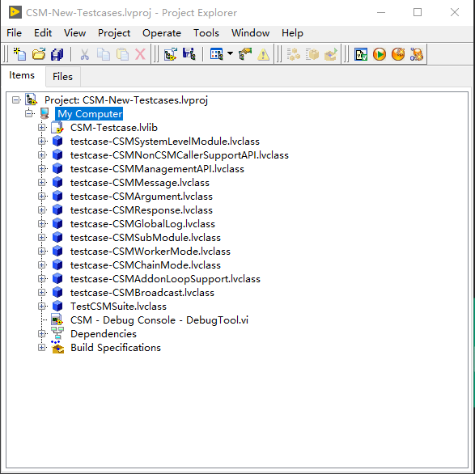
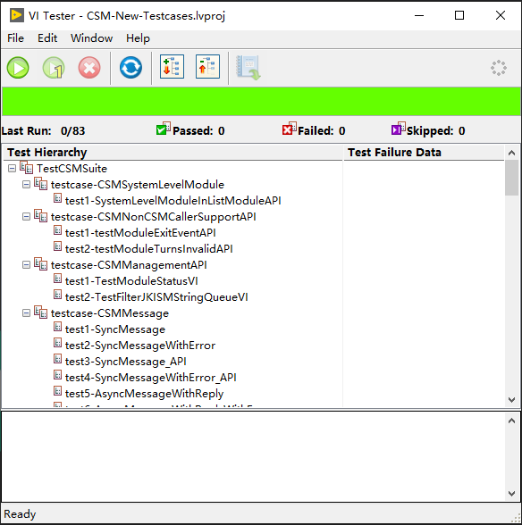

# Communicable State Machine (CSM) Unit Test

## 📖 1 Project Introduction

### 1.1 Project Background
This project utilizes the **JKI VI Tester** toolkit to develop a suite of unit tests for verifying the functional correctness of the **Communicable State Machine (CSM) programming framework**. This unit test suite provides reliable functional verification support for the long-term maintenance of CSM.
The unit tests are integrated into the **Git CI/CD platform**, running tests and generating reports through an automated process, helping CSM framework developers quickly locate issues, maintain, and debug.

### 1.2 Installation Environment
- Windows 10 OS
- NI LabVIEW 2017 (32-bit)
- JKI VI Tester ([JKI VI Tester Toolkit for LabVIEW - VIPM Download](https://www.ni.com/zh-cn/support/downloads/tools-network/download.vi-tester-unit-test-framework.html#378053))

---

## ⚙️ 2 Function Description

The following two images show the LabVIEW project structure and the JKI VI Tester interface respectively:

 

The unit tests are categorized according to CSM framework functionalities and mainly include the following test classes:

1. **Message**
   Test messages between different CSM modes (Normal Mode, SubModule Mode, System Level Mode, Worker Mode, Chain Mode, lvlibp Mode). Synchronous messages, asynchronous messages with reply, and asynchronous messages without reply. Verify if messages are correctly passed, if arguments, response, and error information are also correctly carried.
   Specific test case description is explained in the table below and test code is in `testcase-CSMMessage.lvclass`.
<table>  
  <tr align="left">
      <td> Test Case No. </td>
      <td> Test Case Description </td>
      <td> Test Case VI </td>
      <td> Normal Mode </td>
      <td> Submodule Mode </td>
      <td> System-Level Mode </td>
      <td> Worker Mode </td>
      <td> Chain Mode </td>
      <td> lvlibp </td>
  </tr>
  <tr align="left">
      <td>1</td>
      <td>CSM1 sends a synchronous message to CSM2, CSM2 returns the correct reply, CSM1 enters Response Case to process the reply info</td>
      <td>test1-SyncMessage.vi</td>
      <td>✔</td>
      <td>✔</td>
      <td>✔</td>
      <td>✔</td>
      <td>✔</td>
      <td>✔</td>
  </tr>
  <tr align="left">
      <td>2</td>
      <td>CSM1 sends a synchronous message to CSM2, CSM2 encounters an error, CSM1 enters Response Case carrying the Response and error information</td>
      <td>test2-SycnMessageWithError.vi</td>
      <td>✔</td>
      <td>✔</td>
      <td>✔</td>
      <td>✔</td>
      <td>✔</td>
      <td>✔</td>
  </tr>
  <tr align="left">
      <td>3</td>
      <td>CSM1 uses API to send a synchronous message to CSM2, CSM2 returns the correct Response, CSM1 obtains the return via API</td>
      <td>test3-SyncMessage_API.vi</td>
      <td>✔</td>
      <td>✔</td>
      <td>✔</td>
      <td>✔</td>
      <td>✔</td>
      <td>✔</td>
  </tr>
  <tr align="left">
      <td>4</td>
      <td>CSM1 uses API to send a synchronous message to CSM2, CSM2 encounters an error, CSM1 obtains the Response and error information via API</td>
      <td>test4-SyncMessageWithError_API.vi</td>
      <td>✔</td>
      <td>✔</td>
      <td>✔</td>
      <td>✔</td>
      <td>✔</td>
      <td>✔</td>
  </tr>
  <tr align="left">
      <td>5</td>
      <td>CSM1 sends an asynchronous message with reply to CSM2, CSM2 returns the correct Response, CSM1 enters Async Response to process the reply</td>
      <td>test5-AsyncMessageWithReply.vi</td>
      <td>✔</td>
      <td>✔</td>
      <td>✔</td>
      <td>✔</td>
      <td>✔</td>
      <td>✔</td>
  </tr>
  <tr align="left">
      <td>6</td>
      <td>CSM1 sends an asynchronous message with reply to CSM2, CSM2 encounters an error, CSM1 enters Async Response carrying the Response and error information</td>
      <td>test6-AsyncMessageWithReplyWithError.vi</td>
      <td>✔</td>
      <td>✔</td>
      <td>✔</td>
      <td>✔</td>
      <td>✔</td>
      <td>✔</td>
  </tr>
  <tr align="left">
      <td>7</td>
      <td>CSM1 sends an asynchronous message without reply to CSM2, verifies that CSM2 executes, CSM1 does not process the reply</td>
      <td>test7-AsyncMessageWithoutReply.vi</td>
      <td>✔</td>
      <td>✔</td>
      <td>✔</td>
      <td>✔</td>
      <td>✔</td>
      <td>✔</td>
  </tr>
  <tr align="left">
      <td>8</td>
      <td>CSM1 uses API to send an asynchronous message without reply to CSM, verifies that the caller executes asynchronously, does not process the reply</td>
      <td>test8-AsyncMessageWithoutReply_API.vi</td>
      <td>✔</td>
      <td>✔</td>
      <td>✔</td>
      <td>✔</td>
      <td>✔</td>
      <td>✔</td>
  </tr>
  <tr>
      <td colspan="9">
          Note: CSM modes include Normal Mode, Submodule Mode, System-Level Mode, Worker Mode, Chain Mode, and lvlibp. All possible CSM mode relationships between CSM1 and CSM2 are covered.
      </td>
  </tr>
</table>

2. **Argument**
   Based on message test class, further verify whether arguments/parameters carried by messages can be transmitted normally between different CSM modes (Normal Mode, SubModule Mode, System Level Mode, Worker Mode, Chain Mode, lilvbp Mode).
   Specific test case description is explained in the table below and test code is in  `testcase-CSMArgument.lvclass`.
<table>
  <tr align="left">
      <td> Test Case No. </td>
      <td> Test Case Description </td>
      <td> Test Case VI </td>
      <td> Normal Mode </td>
  </tr>
  <tr align="left">
      <td>1</td>
      <td>Create preset information and verify HexString conversion works correctly: 1. Check a nested complex Cluster; 2. Check empty string parsing behavior.</td>
      <td>test1-HexStr conversion.vi</td>
      <td>✔</td>
  </tr>
  <tr align="left">
      <td>2</td>
      <td>Create preset information and verify ErrorString conversion works correctly: 1. Conversion of Error; 2. Conversion of No Error; 3. Empty string behavior.</td>
      <td>test2-ErrorStr conversion.vi</td>
      <td>✔</td>
  </tr>
  <tr align="left">
      <td>3</td>
      <td>Create preset information and verify SafeString conversion works correctly: 1. Empty string behavior (no conversion for empty string); 2. Behavior with special characters; 3. Behavior with carriage return.</td>
      <td>test3-SafeStr conversion.vi</td>
      <td>✔</td>
  </tr>
  <tr align="left">
      <td>4</td>
      <td>CSM - Argument Type.vi can correctly identify HexString/ErrorString/SafeString types.</td>
      <td>Integrated in test1,2,3</td>
      <td>✔</td>
  </tr>
  <tr align="left">
      <td>5</td>
      <td>Parameters sent from CSM1 to CSM2 are correctly carried into the TargetCSM, i.e., into the CSM.</td>
      <td>test4-ArgumentCanBeTakenToTargetModule.vi</td>
      <td>✔</td>
  </tr>
  <tr>
      <td colspan="9">
          Note: Only normal mode is tested between CSM1 and CSM2, other modes have been tested in the message test class.
      </td>
  </tr>
</table>

3. **Response**
   Verify the correctness of message response/return values between different modes (Normal Mode, SubModule Mode, System Level Mode, Worker Mode, Chain Mode, lilvbp Mode), including the transmission of error information, and aslo test the behavior of response/return values during **macro message** execution meets expectations under different circumstances.
   Specific test case description is explained in the table below and test code is in  `testcase-CSMResponse.lvclass`.
<table>  
    <tr align="left">
            <td> Test Case No. </td>
            <td> Test Case Description </td>
            <td> Test Case VI </td>
            <td> Normal Mode </td>
            <td> Submodule Mode </td>
            <td> System-Level Mode </td>
            <td> Worker Mode </td>
            <td> Chain Mode </td>
            <td> lvlibp </td>
    </tr>
  <tr align="left">
    <td>1</td>
    <td>Basic message response function, already tested in message test class, including Sync/Async/AsyncNoRep</td>
    <td>Tested</td>
      <td>✔</td>
      <td>✔</td>
      <td>✔</td>
      <td>✔</td>
      <td>✔</td>
      <td>✔</td>
  </tr>
  <tr align="left">
    <td>2</td>
    <td>CSM1 sends a message to CSM2, single message response. When an error occurs, it first enters the Error Handler, but still returns the Response of the message execution case.</td>
    <td>test1-ResponseWithError.vi</td>
      <td>✔</td>
      <td>✔</td>
      <td>✔</td>
      <td>✔</td>
      <td>✔</td>
      <td>✔</td>
  </tr>
  <tr align="left">
    <td>3</td>
    <td>Macro message execution returns the response of the last SubMessage</td>
    <td>test2-MacroWithSubMessages.vi</td>
      <td>✔</td>
      <td>✔</td>
      <td>✔</td>
      <td>✔</td>
      <td>✔</td>
      <td>✔</td>
  </tr>
  <tr align="left">
    <td>4</td>
    <td>Macro message execution with PostStep messages returns the response of the last SubMessage</td>
    <td>test3-MacroWithSubAndPostMessages.vi</td>
      <td>✔</td>
      <td>✔</td>
      <td>✔</td>
      <td>✔</td>
      <td>✔</td>
      <td>✔</td>
  </tr>
  <tr align="left">
    <td>5¹</td>
    <td>Macro message execution: if the last SubMessage sends a message to another module (sync/async with response/async no response), the final return value is empty</td>
    <td>test4-MacroWithNonLocalSubMessages.vi</td>
      <td>✔</td>
      <td>✔</td>
      <td>✔</td>
      <td>✔</td>
      <td>✔</td>
      <td>✔</td>
  </tr>
  <tr align="left">
    <td>6</td>
    <td>Message response: Sync message API carries the name of the executing module, already tested in test3-SyncMessage_API.vi of the message test class</td>
    <td>Tested</td>
      <td>✔</td>
      <td>✔</td>
      <td>✔</td>
      <td>✔</td>
      <td>✔</td>
      <td>✔</td>
  </tr>
  <tr align="left">
    <td>7</td>
    <td>In Response/Async Response, the source module name, message name, and message parameters can be obtained, already tested in Sync/Async/AsyncNoRep message test cases.</td>
    <td>Tested</td>
      <td>✔</td>
      <td>✔</td>
      <td>✔</td>
      <td>✔</td>
      <td>✔</td>
      <td>✔</td>
  </tr>
  <tr align="left">
    <td>8</td>
    <td>Message response with Error, already tested in Sync/Async/AsyncNoRep message test cases</td>
    <td>Tested</td>
      <td>✔</td>
      <td>✔</td>
      <td>✔</td>
      <td>✔</td>
      <td>✔</td>
      <td>✔</td>
  </tr>
  <tr>
      <td colspan="9">
       ¹ Related issue tracking:  
          <a href="https://github.com/NEVSTOP-LAB/Communicable-State-Machine/issues/547">
          https://github.com/NEVSTOP-LAB/Communicable-State-Machine/issues/547
          </a>
            
          Note: CSM modes include Normal Mode, Submodule Mode, System-Level Mode, Worker Mode, Chain Mode, and lvlibp. All possible CSM mode relationships between CSM1 and CSM2 are included.
      </td>
  </tr>
</table>

4. **Broadcast**
   Test status, interrupt (high priority), and state change broadcast (state change is a unique broadcast mechanism provided by CSM) across different modes (Normal Mode, SubModule Mode, System Level Mode, Worker Mode, Chain Mode, Packed Project Library Mode), including registration, unregistration, and selective registration (both senders and receivers can flexibly decide priority). Additionally test scenarios where broadcast functionality is called outside the CSM framework, extending cross-framework compatibility.
   Specific test case description is explained in the table below and test code is in  `testcase-CSMBroadcast.lvclass`.
<table>  
  <tr align="left">
      <td> Test Case No. </td>
      <td> Test Case Description </td>
      <td> Test Case VI </td>
      <td> Normal Mode </td>
      <td> Submodule Mode </td>
      <td> System-Level Mode </td>
      <td> Worker Mode </td>
      <td> Chain Mode </td>
      <td> lvlibp </td>
  </tr>
  <tr align="left">
    <td>1</td>
    <td>CSM1 throws Status, can use Register/Unregister internally or externally to control Status triggering the State bound to CSM2</td>
    <td>test1-LocalExternalStatusRegistration.vi</td>
      <td>✔</td>
      <td>✔</td>
      <td>✔</td>
      <td>✔</td>
      <td>✔</td>
      <td>✔</td>      
  </tr>
  <tr align="left">
    <td>2</td>
    <td>CSM1 throws Status, can use API internally or externally to control Status triggering the State bound to CSM2</td>
    <td>test2-LocalExternalStatusRegistrationViaAPI.vi</td>
      <td>✔</td>
      <td>✔</td>
      <td>✔</td>
      <td>✔</td>
      <td>✔</td>
      <td>✔</td>
  </tr>
  <tr align="left">
    <td>3</td>
    <td>CSM1 throws Status, can use API internally or externally to control Status triggering the State bound to CSM2</td>
    <td>test24-MappingRelationshipByExternalRegistration_API.vi</td>
      <td>✔</td>
      <td>✔</td>
      <td>✔</td>
      <td>✔</td>
      <td>✔</td>
      <td>✔</td>
  </tr>
  <tr align="left">
    <td>4</td>
    <td>CSM1 throws Status, when subscribing externally with string syntax, the subscription does not disappear after CSM exits</td>
    <td>test25-MappingRelationshipByExternalRegistration.vi</td>
      <td>✔</td>
      <td>✔</td>
      <td>✔</td>
      <td>✔</td>
      <td>✔</td>
      <td>✔</td>
  </tr>
  <tr align="left">
    <td>5</td>
    <td>CSM1 throws Status, when subscribing internally to its own State: if the subscriber name is explicitly written as CSM1, the subscription does not disappear after exit; if the subscriber name is omitted, the subscription is automatically removed after exit.</td>
    <td>test26-MappingRelationshipByLocalRegistration_WithSubcriberName.vi
         
test27-MappingRelationshipByLocalRegistration_WithoutSubcriberName.vi</td>
      <td>✔</td>
      <td>✔</td>
      <td>✔</td>
      <td>✔</td>
      <td>✔</td>
      <td>✔</td>
  </tr>
  <tr align="left">
    <td>6</td>
    <td>CSM1 throws Status, can be subscribed to multiple States in multiple modules, all will be triggered automatically after throwing</td>
    <td>test3-1ToNBroadcastStatus.vi</td>
      <td>✔</td>
      <td>✔</td>
      <td>✔</td>
      <td>✔</td>
      <td>✔</td>
      <td>✔</td>
  </tr>
  <tr align="left">
    <td>7</td>
    <td>CSM1 throws Status, can be subscribed in non-CSM using UserEvent</td>
    <td>test4-RegisterStatusFromNonCSM.vi</td>
      <td>✔</td>
      <td>✔</td>
      <td>✔</td>
      <td>✔</td>
      <td>✔</td>
      <td>✔</td>
  </tr>
  <tr align="left">
    <td>8</td>
    <td>CSM1/CSM3 throw different Statuses, can be subscribed to CSM2's State, both can trigger CSM2 to execute State</td>
    <td>test5-RegisterMultipleStatusesToOneState.vi</td>
      <td>✔</td>
      <td>✔</td>
      <td>✔</td>
      <td>✔</td>
      <td>✔</td>
      <td>✔</td>
  </tr>
    <tr align="left">
    <td>9</td>
    <td>When subscribing, Source Module Name can use * as a wildcard to subscribe to the same Status from multiple modules at once; unsubscribing from one module's Status does not affect others</td>
    <td>test6-AsteriskWildcardStatusRegistration.vi</td>
      <td>✔</td>
      <td>✔</td>
      <td>✔</td>
      <td>✔</td>
      <td>✔</td>
      <td>✔</td>
  </tr>
  <tr align="left">
    <td>10</td>
    <td>After successful subscription, CSM1 throws Status multiple times, the subscriber receives all State triggers without loss</td>
    <td>test15-LosslessRegisterStatusMultipleTimes.vi</td>
      <td>✔</td>
      <td>✔</td>
      <td>✔</td>
      <td>✔</td>
      <td>✔</td>
      <td>✔</td>
  </tr>
  <tr align="left">
    <td>11</td>
    <td>After successful subscription, CSM1 throws Status multiple times, the subscriber receives all State triggers without loss (subscribed in non-CSM using UserEvent)</td>
    <td>test16-LosslessRegisterStatusMultipleTimesNonCSM.vi</td>
      <td>✔</td>
      <td>✔</td>
      <td>✔</td>
      <td>✔</td>
      <td>✔</td>
      <td>✔</td>
  </tr>
  <tr align="left">
    <td>12</td>
    <td>The Argument of Status is the Argument of the triggered State</td>
    <td>Tested, see test1-LocalExternalStatusRegistration.vi</td>
      <td>✔</td>
      <td>✔</td>
      <td>✔</td>
      <td>✔</td>
      <td>✔</td>
      <td>✔</td>
  </tr>
  <tr align="left">
    <td>13</td>
    <td>The triggered Status can obtain Source State Name/Source module from Argument Info</td>
    <td>test7-TestArgumentInfoOfTriggeredState_Status.vi</td>
      <td>✔</td>
      <td>✔</td>
      <td>✔</td>
      <td>✔</td>
      <td>✔</td>
      <td>✔</td>
  </tr>
  <tr align="left">
    <td>14</td>
    <td>CSM1 throws Interrupt, can be subscribed to multiple States in multiple modules, all will be triggered automatically after throwing</td>
    <td>test19-1ToNInterruptStatus.vi</td>
      <td>✔</td>
      <td>✔</td>
      <td>✔</td>
      <td>✔</td>
      <td>✔</td>
      <td>✔</td>
  </tr>
  <tr align="left">
    <td>15</td>
    <td>CSM1 throws Interrupt, can be subscribed in non-CSM using Interrupt User Event; Status User Event will not trigger</td>
    <td>test21-RegisterInterruptFromNonCSM.vi</td>
      <td>✔</td>
      <td>✔</td>
      <td>✔</td>
      <td>✔</td>
      <td>✔</td>
      <td>✔</td>
  </tr>
  <tr align="left">
    <td>16</td>
    <td>CSM1 throws Status, subscribed as interrupt, can be subscribed in non-CSM using Interrupt User Event; Status User Event will not trigger</td>
    <td>test20-RegisterStatusAsInterruptFromNonCSM.vi
    </td>
      <td>✔</td>
      <td>✔</td>
      <td>✔</td>
      <td>✔</td>
      <td>✔</td>
      <td>✔</td>
  </tr>
    <tr align="left">
    <td>17</td>
    <td>CSM1 throws Interrupt, subscribed as Status, can be subscribed in non-CSM using Status User Event; Interrupt User Event will not trigger</td>
    <td>test22-RegisterInterruptAsStatusFromNonCSM.vi</td>
      <td>✔</td>
      <td>✔</td>
      <td>✔</td>
      <td>✔</td>
      <td>✔</td>
      <td>✔</td>
  </tr>
  <tr align="left">
    <td>18</td>
    <td>CSM1 does not throw Status, its State can use Register/Unregister internally or externally to control Status triggering the State bound to CSM2</td>
    <td>test8-LocalExternalStateRegistration.vi</td>
      <td>✔</td>
      <td>✔</td>
      <td>✔</td>
      <td>✔</td>
      <td>✔</td>
      <td>✔</td>
  </tr>
  <tr align="left">
    <td>19</td>
    <td>CSM1 does not throw Status, its State can use API internally or externally to control Status triggering the State bound to CSM2</td>
    <td>test9-LocalExternalStateRegistrationViaAPI.vi</td>
      <td>✔</td>
      <td>✔</td>
      <td>✔</td>
      <td>✔</td>
      <td>✔</td>
      <td>✔</td>
  </tr>
  <tr align="left">
    <td>20</td>
    <td>CSM1 does not throw Status, when subscribing externally to its State with string syntax, the subscription does not disappear after exit</td>
    <td>test29-MappingRelationshipByExternalRegistration_State.vi</td>
      <td>✔</td>
      <td>✔</td>
      <td>✔</td>
      <td>✔</td>
      <td>✔</td>
      <td>✔</td>
  </tr>
  <tr align="left">
    <td>21</td>
    <td>CSM1 does not throw Status, when subscribing externally to its State via API, the subscription does not disappear after exit</td>
    <td>test28-MappingRelationshipByExternalRegistration_API_State.vi</td>
      <td>✔</td>
      <td>✔</td>
      <td>✔</td>
      <td>✔</td>
      <td>✔</td>
      <td>✔</td>
  </tr>
  <tr align="left">
            <td>22</td>
            <td>CSM1 does not throw Status, when subscribing internally to its own State: if the subscriber name is explicitly written as CSM1, the subscription does not disappear after exit; if the subscriber name is omitted, the subscription is automatically removed after exit.</td>
            <td>test30-MappingRelationshipByLocalRegistration_WIthSubscriberName_State.vi
          
test31-MappingRelationshipByLocalRegistration_WIthoutSubscriberName_State.vi</td>
      <td>✔</td>
      <td>✔</td>
      <td>✔</td>
      <td>✔</td>
      <td>✔</td>
      <td>✔</td>
  </tr>
  <tr align="left">
    <td>23</td>
    <td>CSM1 does not throw Status, its State can be subscribed to multiple States in multiple modules, all will be triggered automatically after throwing</td>
    <td>test10-1ToNBroadcastState.vi</td>
      <td>✔</td>
      <td>✔</td>
      <td>✔</td>
      <td>✔</td>
      <td>✔</td>
      <td>✔</td>
  </tr>
  <tr align="left">
    <td>24</td>
    <td>CSM1 does not throw Status, its State can be subscribed in non-CSM using UserEvent</td>
    <td>test11-RegisterStatesFromNonCSM_State.vi</td>
      <td>✔</td>
      <td>✔</td>
      <td>✔</td>
      <td>✔</td>
      <td>✔</td>
      <td>✔</td>
  </tr>
  <tr align="left">
    <td>25</td>
    <td>CSM1/CSM3 have different States, can be subscribed to CSM2's State, both can trigger CSM2 to execute State</td>
    <td>test12-RegisterMultipleStatesToOneState.vi/td>
      <td>✔</td>
      <td>✔</td>
      <td>✔</td>
      <td>✔</td>
      <td>✔</td>
      <td>✔</td>
  </tr>
  <tr align="left">
    <td>26</td>
    <td>When subscribing, Source Module Name can use * as a wildcard to subscribe to the same State from multiple modules at once; unsubscribing from one module's State does not affect others</td>
    <td>test13-AsteriskWildcardStateRegistration.vi</td>
      <td>✔</td>
      <td>✔</td>
      <td>✔</td>
      <td>✔</td>
      <td>✔</td>
      <td>✔</td>
  </tr>
  <tr align="left">
    <td>27</td>
    <td>After successful subscription, CSM1 throws State multiple times, the subscriber receives all State triggers without loss</td>
    <td>test17-LosslessRegisterStateMultipleTimes.vi</td>
      <td>✔</td>
      <td>✔</td>
      <td>✔</td>
      <td>✔</td>
      <td>✔</td>
      <td>✔</td>
  </tr>
  <tr align="left">
    <td>28</td>
    <td>After successful subscription, CSM1 throws State multiple times, the subscriber receives all State triggers without loss (subscribed in non-CSM using UserEvent)</td>
    <td>test16-LosslessRegisterStateMultipleTimesNonCSM.vi</td>
      <td>✔</td>
      <td>✔</td>
      <td>✔</td>
      <td>✔</td>
      <td>✔</td>
      <td>✔</td>
  </tr>
  <tr align="left">
    <td>29</td>
    <td>The Response of State is the Argument of the triggered State</td>
    <td>Tested, see test8-LocalExternalStateRegistration.vi</td>
      <td>✔</td>
      <td>✔</td>
      <td>✔</td>
      <td>✔</td>
      <td>✔</td>
      <td>✔</td>
  </tr>
  <tr align="left">
    <td>30</td>
    <td>The triggered State can obtain Source State Name/Source module from Argument Info</td>
    <td>test14-TestArgumentInfoOfTriggeredState_State.vi</td>
      <td>✔</td>
      <td>✔</td>
      <td>✔</td>
      <td>✔</td>
      <td>✔</td>
      <td>✔</td>
  </tr>
  <tr align="left">
    <td>31</td>
    <td>Subscribe State as interrupt, in Non-CSM mode, events can only be obtained in interrupt User Event, not in Status User Event</td>
    <td>test23-RegisterStatusAsInterruptFromNonCSM_State.vi</td>
      <td>✔</td>
      <td>✔</td>
      <td>✔</td>
      <td>✔</td>
      <td>✔</td>
      <td>✔</td>
  </tr>
  <tr>
    <td colspan="9">
¹: The unit test VIs of this class are not sorted from top to bottom according to this table, but are sorted according to the actual test machine, especially the performance of the actual running machine for Git CI/CD.
  
        Note: CSM modes include Normal Mode, Submodule Mode, System-Level Mode, Worker Mode, Chain Mode, and lvlibp. All possible CSM mode relationships between CSM1 and CSM2 are included.
    </td>
  </tr>
</table>

5. **Global Log**
   Test global logging functionality across different modes (Normal Mode, SubModule Mode, System Level Mode, Worker Mode, Chain Mode, lilvbp), including module creation and destruction, state change, registration and unregistration, syn messages, async messages with reply, async messages without reply, broadcast, and user-defined log.
   The CSM programming framework provides two implementation methods: Global Log Queue and Global Log User Event. This unit test class covers all possible scenarios for both implementations.
   Specific test case description is explained in the table below and test code is in  `testcase-CSMGlobalLog.lvclass`.
<table>  
  <tr align="left">
      <td> Test Case No. </td>
      <td> Test Case Description </td>
      <td> Test Case VI </td>
      <td> Normal Mode </td>
      <td> Submodule Mode </td>
      <td> System-Level Mode </td>
      <td> Worker Mode </td>
      <td> Chain Mode </td>
      <td> lvlibp </td>
  </tr>
  <tr align="left">
    <td>1</td>
    <td>Module creation and destruction logs (module created/module destroyed) can be obtained through the global log queue, and the number of logs can be checked for correctness</td>
    <td>test1-ModuleCreatedDestroyed_Queue.vi</td>
      <td>✔</td>
      <td>✔</td>
      <td>✔</td>
      <td>✔</td>
      <td>✔</td>
      <td>✔</td>
  </tr>
  <tr align="left">
    <td>2</td>
    <td>Module state change logs (state change) can be obtained through the global log queue: sending a message via external API triggers an internal state change in the CSM module. Both the triggering message and the resulting state change can be seen in the global log.</td>
    <td>test2-StateChange_Queue.vi</td>
      <td>✔</td>
      <td>✔</td>
      <td>✔</td>
      <td>✔</td>
      <td>✔</td>
      <td>✔</td>
  </tr>
  <tr align="left">
    <td>3</td>
    <td>Subscription and unsubscription logs can be obtained through the global log queue. CSM module names in Worker and Chain modes must not have suffixes.</td>
    <td>test3-RegisterUnregister_Queue.vi</td>
      <td>✔</td>
      <td>✔</td>
      <td>✔</td>
      <td>✔</td>
      <td>✔</td>
      <td>✔</td>
  </tr>
  <tr align="left">
    <td>4</td>
    <td>Module message communication logs (message) can be obtained through the global log queue: sending a synchronous message via external API triggers an internal state in CSM1, which then sends a synchronous message to CSM2. Both messages should be strictly logged in the correct format.</td>
    <td>test4-Message_Queue.vi</td>
      <td>✔</td>
      <td>✔</td>
      <td>✔</td>
      <td>✔</td>
      <td>✔</td>
      <td>✔</td>
  </tr>
  <tr align="left">
    <td>5</td>
    <td>Module broadcast logs (broadcast) can be obtained through the global log queue</td>
    <td>test5-Broadcast_Queue.vi</td>
      <td>✔</td>
      <td>✔</td>
      <td>✔</td>
      <td>✔</td>
      <td>✔</td>
      <td>✔</td>
  </tr>
  <tr align="left">
    <td>6</td>
    <td>Module high-priority broadcast logs (interrupt) can be obtained through the global log queue</td>
    <td>test6-Interrupt_Queue.vi</td>
      <td>✔</td>
      <td>✔</td>
      <td>✔</td>
      <td>✔</td>
      <td>✔</td>
      <td>✔</td>
  </tr>
  <tr align="left">
    <td>7</td>
    <td>Module state broadcast logs (state) can be obtained through the global log queue</td>
    <td>test7-StateBroadcast_Queue.vi</td>
      <td>✔</td>
      <td>✔</td>
      <td>✔</td>
      <td>✔</td>
      <td>✔</td>
      <td>✔</td>
  </tr>
  <tr align="left">
    <td>8</td>
    <td>Module custom user message logs can be obtained through the global log queue</td>
    <td>test8-UserLog_Queue.vi</td>
      <td>✔</td>
      <td>✔</td>
      <td>✔</td>
      <td>✔</td>
      <td>✔</td>
      <td>✔</td>
  </tr>
    <tr align="left">
    <td>9</td>
    <td>Module Sync/Async/NoRep-Async message logs can be obtained through the global log queue</td>
    <td>Tested, see test4-Message_Queue.vi</td>
      <td>✔</td>
      <td>✔</td>
      <td>✔</td>
      <td>✔</td>
      <td>✔</td>
      <td>✔</td>
  </tr>
  <tr align="left">
    <td>10</td>
    <td>Module creation and destruction logs (module created/module destroyed) can be obtained through global log custom events, and the number of logs can be checked for correctness</td>
    <td>test9-ModuleCreatedDestroyed_Event.vi</td>
      <td>✔</td>
      <td>✔</td>
      <td>✔</td>
      <td>✔</td>
      <td>✔</td>
      <td>✔</td>
  </tr>
  <tr align="left">
    <td>11</td>
    <td>Module state change logs (state change) can be obtained through global log custom events: sending a message via external API triggers an internal state change in the CSM module. Both the triggering message and the resulting state change can be seen in the global log.</td>
    <td>test10-StateChange_Event.vi</td>
      <td>✔</td>
      <td>✔</td>
      <td>✔</td>
      <td>✔</td>
      <td>✔</td>
      <td>✔</td>
  </tr>
  <tr align="left">
    <td>12</td>
    <td>Subscription and unsubscription logs can be obtained through global log custom events. CSM module names in Worker and Chain modes must not have suffixes.</td>
    <td>test11-RegisterUnregister_Event.vi</td>
      <td>✔</td>
      <td>✔</td>
      <td>✔</td>
      <td>✔</td>
      <td>✔</td>
      <td>✔</td>
  </tr>
  <tr align="left">
    <td>13</td>
    <td>Module message communication logs (message) can be obtained through global log custom events</td>
    <td>test12-Message_Event.vi</td>
      <td>✔</td>
      <td>✔</td>
      <td>✔</td>
      <td>✔</td>
      <td>✔</td>
      <td>✔</td>
  </tr>
  <tr align="left">
    <td>14</td>
    <td>Module broadcast logs (broadcast) can be obtained through global log custom events</td>
    <td>test13-Broadcast_Event.vi</td>
      <td>✔</td>
      <td>✔</td>
      <td>✔</td>
      <td>✔</td>
      <td>✔</td>
      <td>✔</td>
  </tr>
  <tr align="left">
    <td>15</td>
    <td>Module high-priority broadcast logs (interrupt) can be obtained through global log custom events</td>
    <td>test14-Interrupt_Event.vi</td>
      <td>✔</td>
      <td>✔</td>
      <td>✔</td>
      <td>✔</td>
      <td>✔</td>
      <td>✔</td>
  </tr>
  <tr align="left">
    <td>16</td>
    <td>Module state broadcast logs (state) can be obtained through global log custom events</td>
    <td>test15-StateBroadcast_Event.vi</td>
      <td>✔</td>
      <td>✔</td>
      <td>✔</td>
      <td>✔</td>
      <td>✔</td>
      <td>✔</td>
  </tr>
    <tr align="left">
    <td>17</td>
    <td>Module custom user message logs can be obtained through global log custom events</td>
    <td>test16-UserLog_Event.vi</td>
      <td>✔</td>
      <td>✔</td>
      <td>✔</td>
      <td>✔</td>
      <td>✔</td>
      <td>✔</td>
  </tr>
  <tr align="left">
    <td>18</td>
    <td>Module Sync/Async/NoRep-Async message logs can be obtained through global log custom events</td>
    <td>Tested, see test12-Message_Event.vi</td>
      <td>✔</td>
      <td>✔</td>
      <td>✔</td>
      <td>✔</td>
      <td>✔</td>
      <td>✔</td>
  </tr>
  <tr>
    <td colspan="9">

Note: CSM modes include Normal Mode, Submodule Mode, System-Level Mode, Worker Mode, Chain Mode, and lvlibp. All possible CSM mode relationships between CSM1 and CSM2 are included.
    </td>
  </tr>
</table>

6. **System Level Module**
   Test the `CSM List Module.vi` API functionality by modifying the input Scope parameter to identify scenarios that include or exclude system-level modules. Other related system-level module functionalities have been covered in the Message class tests.
   Specific test case description is explained in the table below and test code is in  `testcase-CSMSystemLevelModule.lvclass`.
<table>  
  <tr align="left">
      <td> Test Case No. </td>
      <td> Test Case Description </td>
      <td> Test Case VI </td>
      <td> Normal Mode </td>
      <td> Submodule Mode </td>
      <td> System-Level Mode </td>
      <td> Worker Mode </td>
      <td> Chain Mode </td>
      <td> lvlibp </td>
  </tr>
  <tr align="left">
    <td>1</td>
    <td>CSM List Module.vi by default cannot list system-level modules, but after changing the scope to 'all', they can be recognized</td>
    <td>test1-SystemLevelModuleInListModuleAPI.vi</td>
      <td>✔</td>
      <td>✔</td>
      <td>✔</td>
      <td>✔</td>
      <td>✔</td>
      <td>✔</td>
  </tr>
  <tr align="left">
    <td>2</td>
    <td>The message function of System-Level has already been tested in the Sync/Async/AsyncNoRep message test cases</td>
    <td>Tested, see message class tests</td>
      <td>✔</td>
      <td>✔</td>
      <td>✔</td>
      <td>✔</td>
      <td>✔</td>
      <td>✔</td>
  </tr>
</table>

7. **SubModule**
   Test the `CSM List SubModules.vi` API functionality to correctly find corresponding first-level or multi-level submodules(resursive) based on the input module/submodule names.
   Specific test case description is explained in the table below and test code is in  `testcase-CSMSubModule.lvclass`.
<table>  
    <tr align="left">
      <td> Test Case No. </td>
      <td> Test Case Description </td>
      <td> Test Case VI </td>
      <td> Submodule Mode </td>
    </tr>
  <tr align="left">
      <td>1</td>
      <td>CSM List SubModules.vi: When UI, UI.a1 (not existing), UI.a2, UI.a1.b1, and UI.a2.b2 exist, it can correctly list the required submodules according to the input parameters</td>
      <td>test1-ListSubModulesInDifferentSenarios.vi</td>
      <td>✔</td>
  </tr>
</table>

8. **Worker Mode**
   Test data sharing among multiple worker nodes, ensuring data written externally can be read by all nodes via `CSM Attribute`. Other related functionalities have been covered in the Message class tests.
   Specific test case description is explained in the table below and test code is in  `testcase-CSMWorkerMode.lvclass`.
<table>  
    <tr align="left">
      <td> Test Case No. </td>
      <td> Test Case Description </td>
      <td> Test Case VI </td>
      <td> Worker Mode </td>
    </tr>
  <tr align="left">
      <td>1</td>
      <td>All nodes share the same CSM Attribute data space; data written externally is read identically by all internal modules</td>
      <td>test1-AllWorkerNodesShareTheSameData.vi</td>
      <td>✔</td>
  </tr>
</table>

9. **Chain Mode**
   Test data sharing and message processing among multiple nodes, verify whether Allowed Messages defined by different nodes can be processed and report errors correctly, and test the sequence of node exit. Other related functionalities have been covered in the Message class tests.
   Specific test case description is explained in the table below and test code is in  `testcase-CSMChainMode.lvclass`.
<table>  
  <tr align="left">
      <td> Test Case No. </td>
      <td> Test Case Description </td>
      <td> Test Case VI </td>
      <td> Chain Mode </td>
  </tr>
  <tr align="left">
      <td>1</td>
      <td>All nodes share the same CSM Attribute data space. Data written externally is read identically by all internal modules.</td>
      <td>test1-AllChainNodesShareTheSameData.vi</td>
      <td>✔</td>
  </tr>
  <tr align="left">
      <td>2</td>
      <td>Three nodes (A->B->C), each with different Allowed Messages. Messages are sent to the corresponding allowed module; using the API to send synchronous messages returns the correct parameters.</td>
      <td>test2-DifferentChainNodesProcessDifferentAllowedMessages.vi</td>
      <td>✔</td>
  </tr>
  <tr align="left">
      <td>3</td>
      <td>Three nodes (A->B->C), with Allowed Messages combinations of AB, BC, AC, and ABC. Messages should be executed by the first node in the chain. Using the API to send synchronous messages returns the correct parameters.</td>
      <td>test3-FirstChainNodeProcessesAllowedMessages.vi</td>
      <td>✔</td>
  </tr>
  <tr align="left">
      <td>4</td>
      <td>Three nodes (A->B->C), with Allowed Messages defined. If no module can execute the message, the sender reports an error.</td>
      <td>test4-EndNodeHandlesErrorForNotAllowedMessages.vi</td>
      <td>✔</td>
  </tr>
  <tr align="left">
      <td>5</td>
      <td>Three nodes (A->B->C), each node broadcasts a message. After subscribing, the corresponding module's API is triggered; after unsubscribing, none can be triggered.</td>
      <td>test5-ChainNodeBroadcast.vi</td>
      <td>✔</td>
  </tr>
  <tr align="left">
      <td>6</td>
      <td>Three nodes (A->B->C). If the "Macro: Exit" command does not specify a node (i.e., uses the core name without the $ suffix), nodes should exit in order from the end to the head of the chain. If the command specifies a node, only that node exits and others are unaffected.</td>
      <td>test6-ChainNodeExitSequenceCheck.vi</td>
      <td>✔</td>
  </tr>
  </tr>

</table>

10. **Management API**
    Test CSM built-in management APIs, such as `Module Status.vi`, verifying if they can correctly read module information (name, node count, etc.), and test the polymorphic VI with various filtering functions. Other related functionalities have been covered in the Message class tests.
   Specific test case description is explained in the table below and test code is in  `testcase-CSMManagementAPI.lvclass`.
<table>  
  <tr align="left">
      <td> Test Case No. </td>
      <td> Test Case Description </td>
      <td> Test Case VI </td>
      <td> Normal Mode </td>
      <td> Submodule Mode </td>
      <td> System-Level Mode </td>
      <td> Worker Mode </td>
      <td> Chain Mode </td>
      <td> lvlibp </td>
  </tr>
  <tr align="left">
      <td>1</td>
      <td>After module instantiation, this interface can be used to read module information. Test whether all different Modes can be read and whether the number of nodes is correct. The number of items in the message queue does not need to be tested.</td>
      <td>test1-TestModuleStatusVI.vi</td>
      <td>✔</td>
      <td>✔</td>
      <td>✔</td>
      <td>✔</td>
      <td>✔</td>
      <td>✔</td>
  </tr>
  <tr align="left">
      <td>2</td>
      <td>Create a complex message list and test that the filter function only filters the corresponding messages. Test the filter function of each VI in the polymorphic VI. Actual sending is not required.</td>
      <td>test2-TestFilterJKISMStringQueueVI.vi</td>
      <td>✔</td>
      <td>✔</td>
      <td>✔</td>
      <td>✔</td>
      <td>✔</td>
      <td>✔</td>
  </tr>
</table>

11. **Non-CSM Caller Support API**
    Test APIs that take effect when a module exits, such as `Module Exit Event.vi` and `Module Turns Invalid.vi`. Other related functionalities have been covered in the Message class tests.
    Specific test case description is explained in the table below and test code is in  `testcase-CSMNonCSMCallerSupportAPI.lvclass`.
<table>  
  <tr align="left">
      <td> Test Case No. </td>
      <td> Test Case Description </td>
      <td> Test Case VI </td>
      <td> Normal Mode </td>
      <td> Submodule Mode </td>
      <td> System-Level Mode </td>
      <td> Worker Mode </td>
      <td> Chain Mode </td>
      <td> lvlibp </td>
  </tr>
  <tr align="left">
      <td>1</td>
      <td>Module exit can trigger the Exit Module event. In Worker and Chain modes, this event is triggered only when all modules have exited.</td>
      <td>test1-testModuleExitEventAPI.vi</td>
      <td>✔</td>
      <td>✔</td>
      <td>✔</td>
      <td>✔</td>
      <td>✔</td>
      <td>✔</td>
  </tr>
  <tr align="left">
      <td>2</td>
      <td>Module exit can trigger this status change. In Worker and Chain modes, this event is triggered only when all modules have exited.</td>
      <td>test2-testModuleTurnsInvalidAPI.vi</td>
      <td>✔</td>
      <td>✔</td>
      <td>✔</td>
      <td>✔</td>
      <td>✔</td>
      <td>✔</td>
  </tr>
</table>

12. **CSM Loop Support**
    Test the loop mode supported by the CSM framework, verifying that a module can both receive and process external messages while running in a loop, and send messages to other modules without blocking the running loop.
   Specific test case description is explained in the table below and test code is in `testcase-CSMAddonLoopSupport.lvclass`.
<table>  
  <tr align="left">
      <td> Test Case No. </td>
      <td> Test Case Description </td>
      <td> Test Case VI </td>
      <td> Normal Mode </td>
      <td> Submodule Mode </td>
      <td> System-Level Mode </td>
      <td> lvlibp </td>
  </tr>
  <tr align="left">
      <td>1</td>
      <td>While running in Loop mode: 1. Can receive and process synchronous messages sent from outside; 2. Can also send synchronous messages to other modules.</td>
      <td>test1-ProcessSyncMessageInCSMLoop(SendAndReceive).vi</td>
      <td>✔</td>
      <td>✔</td>
      <td>✔</td>
      <td>✔</td>
  </tr>
  <tr align="left">
      <td>2</td>
      <td>While running in Loop mode: 1. Can receive and process asynchronous messages with reply sent from outside; 2. Can also send asynchronous messages with reply to other modules.</td>
      <td>test2-ProcessAsyncMessageWithReplyInCSMLoop(SendAndReceive).vi
      </td>
      <td>✔</td>
      <td>✔</td>
      <td>✔</td>
      <td>✔</td>
  </tr>
  <tr align="left">
      <td>3</td>
      <td>While running in Loop mode: 1. Can receive and process asynchronous messages without reply sent from outside; 2. Can also send asynchronous messages without reply to other modules.</td>
      <td>test3-ProcessAsyncMessageWithoutReplyInCSMLoop(SendAndReceive).vi
      </td>
      <td>✔</td>
      <td>✔</td>
      <td>✔</td>
      <td>✔</td>
  </tr>
  <tr>
      <td colspan="7">
          Note: The CSM (=worker and chain modes are special module patterns composed of multiple running nodes. Messages sent in these modes cannot reliably target a specific node to execute. When a node operates in worker or chain modes, it cannot be clearly instructed by messages to stop a loop. Therefore, it is not recommended to use the CSM Loop Support addon in worker and chain modes. Therefore, this testclass does not cover worker and chain modes.
      </td>
  </tr>
</table>

---

## 🛡️ 3 Maintenance Notes

To ensure the long-term maintenance and stable operation of this unit test suite, please read the following:

1. **Broadcast Test Order**
   It is recommended to place the Broadcast test class as the last class of the test suite to execute because it consumes many hardware resources. Improper testing may affect subsequent tests.

2. **Add New Test Case**
   If you need to add new test case, please first check the tail code of the current last test case in the corresponding test class. If restarting the CSM modules has been disabled, please enable it first. Then add the new test case as the last case and decide whether to restart the CSM modules or not in the tail code of this newly added test case.

3. **Recommended Debugging Tool**
   It is recommended to use the CSM's built-in debugging tool `Debug Console – DebugTool.vi`. We can use this tool to manually send messages between different modules, view return values, and perform advanced debugging by monitoring log performance parameters (such as logging handling speed, logging queue count).

---

## 📜 4 License
This project follows the MIT License.

---

## 🔗 5 Related Resources
- [NI LabVIEW Official Documentation](https://www.ni.com/labview)
- [CSM Framework Wiki](https://github.com/NEVSTOP-LAB/Communicable-State-Machine)
- [JKI VI Tester Toolkit](https://www.ni.com/zh-cn/support/downloads/tools-network/download.vi-tester-unit-test-framework.html#378053)