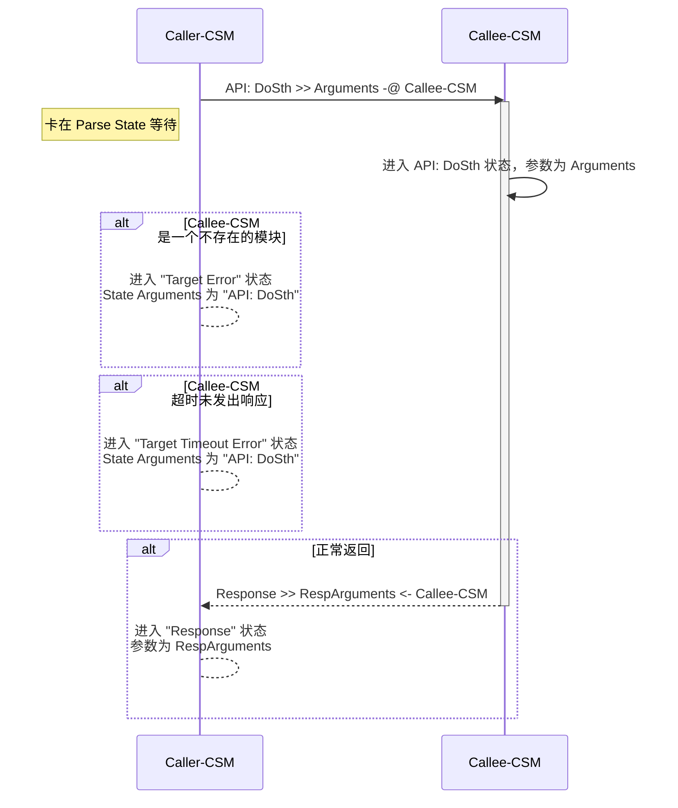
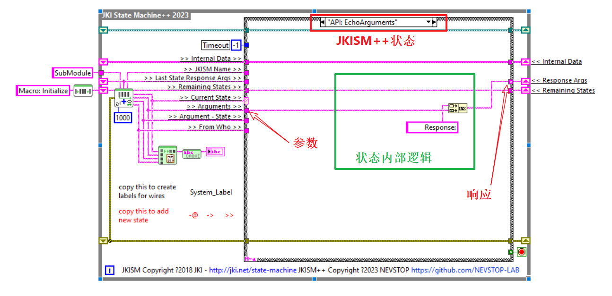
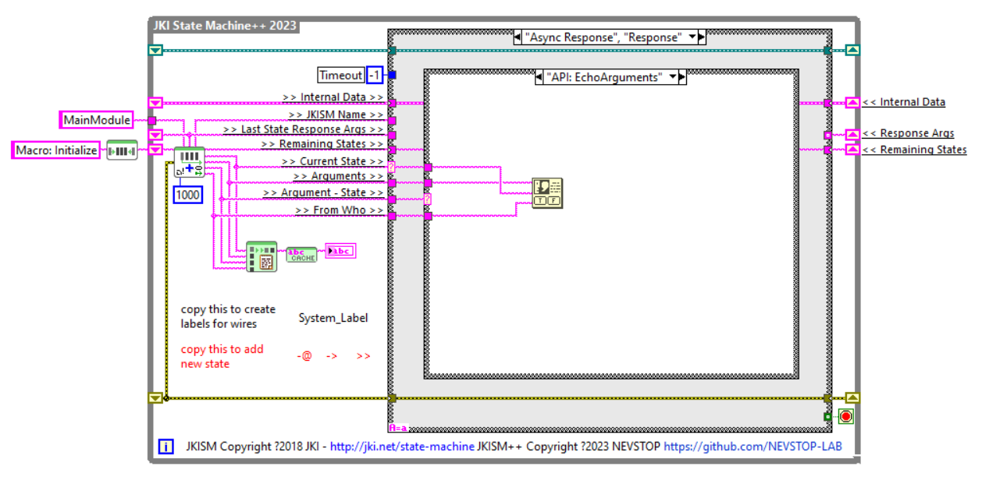

# 同步调用 (-@)

`同步消息`是`消息`的一种。CSM 发出`同步消息`后，将暂停`状态`变化，等待被调用方完成`消息`处理。`同步消息`通过 -@ 描述。
一个 CSM模块通过`同步消息`对另一个模块的调用，叫做`同步调用`。

## CSM `同步消息` 执行过程

## 示例

### 底层模块

**"SubModule" 模块实现 "API: EchoArguments" 状态**

    功能：将参数作为响应返回。

### CSM 模块间的同步调用

**"MainModule" 模块通过 "API: EchoArguments >> xyz -@ SubModule"同步调用SubModule执行"API: EchoArguments" 状态**

按键中添加同步消息 "API: EchoArguments >> xyz -@ SubModule"

在"Response"状态中处理同步消息的响应

**运行状态**

先运行 SubModule，再运行主模块，点击按钮。

### 非 CSM 的调用

可以使用 `AdvanceAPI\CSM Send Message and Wait for Reply.vi` 在非CSM的代码中调用 SubModule 的"API: EchoArguments" 状态

