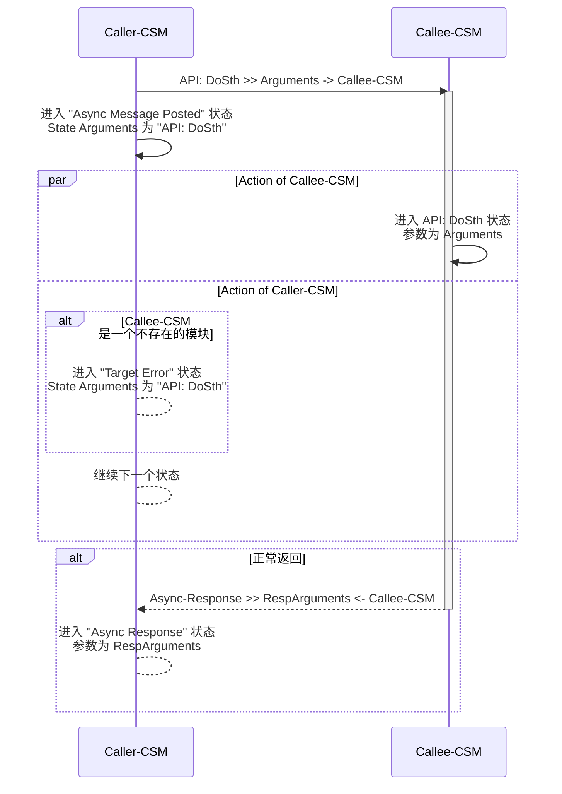
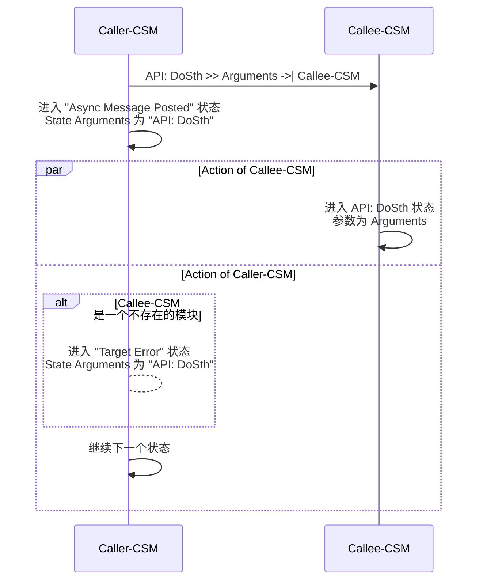
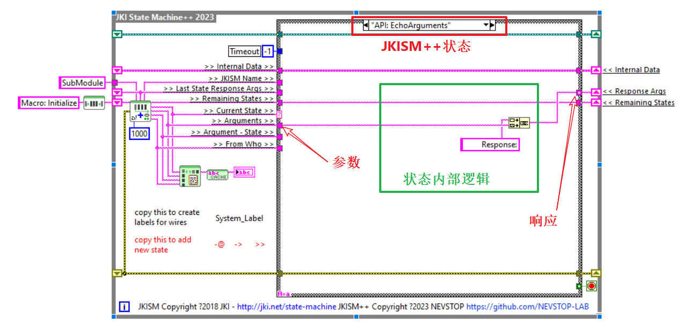

# 异步调用

`异步消息`是消息的一种。CSM发出`异步消息`后，不等待被调用方完成消息处理，继续进行`状态`变化。
`异步消息`也分为两种:

 - `有返回的异步消息`：通过 `->` 描述。被调用方完成`消息`处理后，将通知调用方
 - `无返回的异步消息`：通过 `->|` 描述，被调用方不会通知调用方

一个 CSM模块通过`异步消息`对另一个模块的调用，叫做异步调用。

## CSM `异步消息` 执行过程

### 有返回的异步消息 (->)

## 无返回的异步消息 (->|)

## 示例

### 底层模块

**"SubModule" 模块实现 "API: EchoArguments" 状态**

    功能：将参数作为响应返回。

### CSM 模块间的异步调用

#### 有返回的异步消息 (->)

 - **"MainModule" 模块通过 "API: EchoArguments >> xyz -> SubModule" 异步调用 SubModule 执行"API: EchoArguments" 状态。**
 - **发送后立刻进入"Async Message Posted"。**
 - **因为使用的 -> 为带返回的异步消息符号, 会在执行完毕后进入 "Async Response"状态处理返回参数**

按键中添加同步消息 "API: EchoArguments >> xyz -> SubModule"

在"Async Response"状态中处理同步消息的响应

#### 无返回的异步消息 (->|)

 - **"MainModule" 模块通过 "API: EchoArguments >> xyz ->| SubModule" 也可以异步调用 SubModule 执行"API: EchoArguments" 状态。**
 - **发送后立刻进入"Async Message Posted"。**
 - **因为使用的 ->| 为不带返回的异步消息符号，将不收到任何响应**

按键中添加同步消息 "API: EchoArguments >> xyz ->| SubModule"

**运行状态**

在带返回消息的情况下，先运行 SubModule，再运行主模块，点击按钮, 将弹出下图对话框。在没有返回消息的情况下，虽然 SubModule 执行了状态，MainModule 不发生弹框。

### 非 CSM 的调用

可以使用 `AdvanceAPI\CSM Post Message.vi` 在非CSM的代码中调用 SubModule 的"API: EchoArguments" 状态, 消息会被发送执行，但是没有任何返回。

