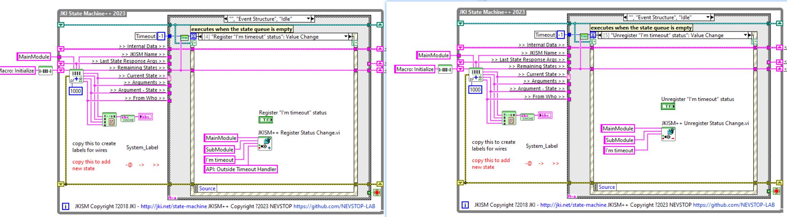
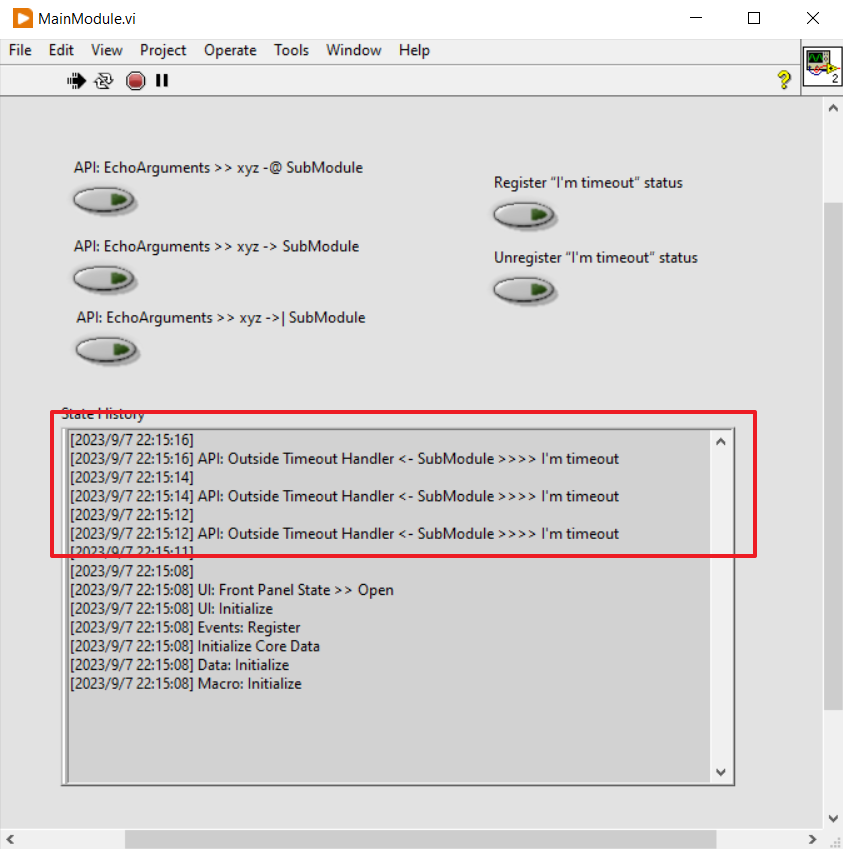

# 状态订阅

## 设计说明

### 原因

`状态(Status)`是 CSM 通知外部自身状态变化的特殊消息。外部的模块需要注册状态后，才会处理对应的状态变化。

`状态(Status)` 的设计加入，能够更好的实现不同功能模块的解耦，提高复用性。它能保证具有关联性的模块在设计时，不去关心与其他模块的交互，而是转换为自身状态变化的设计，从而实现更好的独立性。整体业务逻辑实现时，注册模块的状态，与具有交互关系的模块消息接口绑定，实现相关间的交换逻辑。

状态的订阅、取消订阅能够动态完成，程序的灵活性更高。

### 举例：实现音乐下载完毕后自动播放功能**

根据场景，实现 `下载模块` `音乐播放模块` 两个模块，能够更好的复用，且逻辑划分清楚。

如果没有 `状态(Status)`，可能有以下实现方法：

1. `下载模块` 内部完成下载后，需要通知 `音乐播放模块` 开始播放，内部需要了解 `音乐播放模块` 及其接口，彼此将包含依赖关系
2. 外围业务逻辑 **阻塞式调用** `下载模块` 的下载接口，完毕后由外围业务逻辑调用 `音乐播放模块`播放接口，灵活度受限

在添加了`状态(Status)`后，实现变为：
1. 状态订阅
　－　`下载模块` 实现时，在下载完成后，发出下载完成状态，并携带下载文件路径的参数。无需考虑与外部模块的交互。
　－　`音乐播放模块`照旧，实现播放接口，参数为文件路径
　－　业务逻辑将`下载模块`的下载完成状态注册到`音乐播放模块`的播放接口，下载完成后自动会触发播放。
　－　可以动态取消。如果下载的是视频文件，与`视频播放模块`的交互方法类似，模块间交互优雅简单。


## CSM 状态设计

### CSM 状态发布

1. 通过 `CSM Broadcast Status Change.vi` 发布状态，可携带`参数`


1. 直接通过字符串描述, 以下描述完成和上截图相同的状态发布

```
I'm timeout >> statusArguments -> <all>
```

### JIMSM++ 状态订阅

通过 `AdvanceAPI\CSM Register Status Change.vi` 和 `AdvanceAPI\CSM Unregister Status Change.vi` 订阅和取消订阅。"*" 可以代表所有模块，例如 CSM Template 都将发布 "Error Occured" 状态，如果订阅 "\*" 的"Error Occured" 状态，能够收到除自己外所有模块的错误发生。


### JIMSM++ 举例

**`SubModule` 每 2000ms 发布 "I'm timout" 状态**


**`MainModule`可以通过按钮动态订阅/取消订阅 "I'm timout" 状态**



**订阅后的结果**



