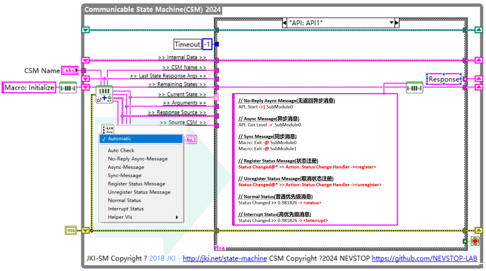

# 可通信状态机 (Communicable State Machine, CSM)

[English](./README.md) | [中文](./README(zh-cn).md)

[](https://www.vipm.io/package/nevstop_lib_communicable_state_machine/)
[](https://www.vipm.io/package/nevstop_lib_communicable_state_machine/)
[](https://github.com/NEVSTOP-LAB/Communicable-State-Machine/releases)

可通信状态机（CSM）是基于 JKI 状态机（JKISM）构建的 LabVIEW 应用框架。它扩展了 JKISM 的关键词，支持模块间通信功能，包括同步消息、异步消息、状态订阅/取消订阅等，这些都是构建可重用代码模块的核心特性。更多信息请访问 CSM Wiki: <https://nevstop-lab.github.io/CSM-Wiki/>

- 了解更多 JKI State Machine (JKISM): <http://jki.net/state-machine/>
- 了解更多 NEVSTOP-LAB: <https://github.com/NEVSTOP-LAB>



_**CSM 函数面板**_


**代码模板介绍：**  
[English](src/help/NEVSTOP/Communicable%20State%20Machine(CSM)/Template%20Description(EN).md) | [中文](src/help/NEVSTOP/Communicable%20State%20Machine(CSM)/Template%20Description(zh-cn).md)

**API 介绍：**  
[English](src/help/NEVSTOP/Communicable%20State%20Machine(CSM)/VI%20Description(EN).md) | [中文](src/help/NEVSTOP/Communicable%20State%20Machine(CSM)/VI%20Description(zh-cn).md)

## 创建可重用模块

可重用模块通常不需要与其他模块通信，只需提供外部接口并发布状态变化。只要明确定义这两个方面，即可在不了解内部实现的情况下调用该模块。

在 CSM 模块中，所有 case 分支都可作为消息调用，但建议使用 API 类别作为外部接口。要发送状态更新，可使用 Status 或 Interrupt Status 通知外部实体状态变化。

参考示例 _**/Example/1. Create a reusable module**_。

## 将 CSM 用作应用框架

在此场景下，模块间通信依赖消息字符串队列操作。你可以使用 **Build Message with Arguments++.vi** 函数生成消息字符串，或者如果熟悉语法，可以直接编写。

``` c++
#CSM 状态语法
    // 本地消息
    DoSth: DoA >> 参数

    // 同步调用
    API: xxxx >> 参数 -@ TargetModule

    // 异步调用
    API: xxxx >> 参数 -> TargetModule

    // 无应答异步调用
    API: xxxx >> 参数 ->| TargetModule

    // 广播正常状态
    Status >> StatusArguments -><status>

    // 广播中断状态
    Interrupt >> StatusArguments -><interrupt>

    // 注册源模块状态到处理模块
    Status@Source Module >> API@Handler Module -><register>

    // 取消注册源模块状态
    Status@Source Module >> API@Handler Module -><unregister>

#CSM 注释
    // 使用 "//" 添加注释，右侧所有文本将被忽略
    UI: Initialize // 初始化 UI
    // Another comment line
```

更多语法信息请访问: [Syntax.md](https://github.com/NEVSTOP-LAB/Communicable-State-Machine/tree/main/.doc/Syntax.md)

参考示例 _**/Example/2. Caller is CSM Scenario**_。

## 在其他框架中重用 CSM 模块

在此场景下，模块间通信依赖 Post/Send Message API 和模块状态变化用户事件。

参考示例 _**/Example/3. Caller is Other Framework Scenario**_。

## CSM 参数支持

JKISM 仅支持 STRING 类型参数，但应用需要传输各种数据类型。下表列出了当前参数支持选项，部分为内置功能，其他需要安装插件。

| 参数 | 类型 | 描述 |
|---|---|---|
| SafeStr | 内置 | 特殊字符（"->\| -> -@ & <- , ; []{}`"）将被替换为 %[HEXCODE] |
| HexStr | 内置 | 数据转换为 variant 并编码为十六进制字符串 |
| [MassData](https://github.com/NEVSTOP-LAB/CSM-MassData-Parameter-Support) | 插件 | 数据存储在循环缓冲区中，传递起始位置和长度作为参数 |
| [API String Arguments](https://github.com/NEVSTOP-LAB/CSM-API-String-Arugments-Support) | 插件 | 支持纯字符串作为 CSM API 参数 |
| [INI Static Variable](https://github.com/NEVSTOP-LAB/CSM-INI-Static-Variable-Support) | 插件 | 为 CSM 提供 ${variable} 变量支持 |
