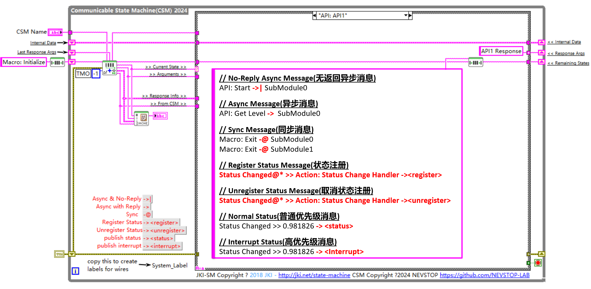

# 可通信状态机 (Communicable State Machine, CSM)

[English](./README.md) | [中文](./README(zh-cn).md)

[](https://www.vipm.io/package/nevstop_lib_communicable_state_machine/)
[](https://www.vipm.io/package/nevstop_lib_communicable_state_machine/)
[](https://github.com/NEVSTOP-LAB/Communicable-State-Machine/releases)

可通信状态机（CSM）是一个基于JKI状态机（JKISM）的LabVIEW应用框架。它遵循JKISM的设计模式，扩展了关键词以描述模块间的消息通信机制，包括同步消息、异步消息、状态订阅/取消订阅等关键概念——这些都是创建可重用代码模块不可或缺的要素。更多信息请访问CSM Wiki页面：<https://nevstop-lab.github.io/CSM-Wiki/>

- 了解更多关于 JKI State Machine(JKISM) 的信息，请访问: <http://jki.net/state-machine/>
- 了解更多关于 NEVSTOP-LAB 的信息，请访问: <https://github.com/NEVSTOP-LAB>



_**CSM 函数面板**_


CSM 代码模板介绍：
[English](src/help/NEVSTOP/Communicable%20State%20Machine(CSM)/Template%20Description(EN).md) | [中文](src/help/NEVSTOP/Communicable%20State%20Machine(CSM)/Template%20Description(zh-cn).md)

CSM API 介绍：
[English](src/help/NEVSTOP/Communicable%20State%20Machine(CSM)/VI%20Description(EN).md) | [中文](src/help/NEVSTOP/Communicable%20State%20Machine(CSM)/VI%20Description(zh-cn).md)

## 创建基于 CSM 的可重用模块

创建一个可重用模块通常不需要与其他模块进行消息交互，只需提供外部接口并发布模块的状态变化。因此，只要这两个方面描述清晰，即使不了解内部实现细节，也能调用该可重用模块。

在CSM模块中，所有case分支都可被视为可调用的消息，但建议使用API分组作为外部接口。当需要发送状态更新时，可以通过发送Status或Interrupt Status来通知外部模块内部的状态变化。

可参考示例 _**/Example/1. Create a reusable module**_。

## 使用 CSM 作为应用框架场景

在这种场景下，模块间的通信完全依赖于消息字符串队列操作。你可以使用 **Build Message with Arguments++.vi** 函数生成一个Message字符串，或者，如果你熟悉规则，也可以直接编写用于描述通信的字符串。

``` c++
#CSM 状态语法
    // 本地消息示例
    DoSth: DoA >> 参数

    // 同步调用示例
    API: xxxx >> 参数 -@ TargetModule

    // 异步调用示例
    API: xxxx >> 参数 -> TargetModule

    // 无应答异步调用示例
    API: xxxx >> 参数 ->| TargetModule

    // 广播正常状态：
    Status >> StatusArguments -><status>

    // 广播中断状态：
    Interrupt >> StatusArguments -><interrupt>

    // 将源模块的状态注册到处理程序模块
    Status@Source Module >> API@Handler Module -><register>

    // 取消注册源模块的状态
    Status@Source Module >> API@Handler Module -><unregister>

#CSM 注释
    // 要添加注释，请使用 "//"，右边的所有文本将被忽略。
    UI: Initialize // 初始化 UI
    // Another comment line
```

更多语法信息请访问：[Syntax.md](https://github.com/NEVSTOP-LAB/Communicable-State-Machine/tree/main/.doc/Syntax.md)

可参考示例 _**/Example/2. Caller is CSM Scenario**_。

## 在其他应用框架中重用 CSM 模块

在这种情况下，模块间的通信完全依赖于Post/Send Message API和模块状态更改用户事件。

可参考示例 _**/Example/3. Caller is Other Framework Scenario**_。

## CSM 参数支持

JKISM只支持STRING类型作为参数，但实际应用中需要传输的数据种类繁多。因此，参数支持功能至关重要。下表列出了当前支持不同数据类型的几种方式，其中部分是CSM内置的，其他则需要安装额外的支持插件。

| 参数 | 类型 | 描述 |
|---|---|---|
| SafeStr | 内置 | "->\| -> -@ & <- ，； []{} `"将被替换为%[HEXCODE] |
| HexStr | 内置 | 数据将被转换为十六进制字符串作为参数 |
|[MassData](https://github.com/NEVSTOP-LAB/CSM-MassData-Parameter-Support) |插件|数据将被保存在循环缓冲区中，传递时包含起始地址和数据长度|
|[API Arguments](https://github.com/NEVSTOP-LAB/CSM-API-String-Arugments-Support) |插件|支持将纯字符串作为CSM API参数|
|[INI Static Variable](https://github.com/NEVSTOP-LAB/CSM-INI-Static-Variable-Support)|插件|为CSM提供${variable}变量支持|
